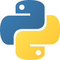

        

# Python Crash Course

## Reading/Resources

### General:
[Why Python?](http://www.bestprogramminglanguagefor.me/why-learn-python)

[Python Basic Syntax](https://www.w3schools.com/python/python_syntax.asp)

[Python Functions](https://www.w3schools.com/python/python_functions.asp)

[Python Classes](https://www.w3schools.com/python/python_classes.asp)

[Python 3 Docs](https://docs.python.org/3.6/)

### Python Module Docs:
[time](https://docs.python.org/3/library/time.html)

[http.server](https://docs.python.org/3/library/http.server.html)

[pathlib](https://docs.python.org/3/library/pathlib.html)

[os](https://docs.python.org/3/library/os.html)

### VSCode Extensions:
[Python](https://marketplace.visualstudio.com/items?itemName=ms-python.python)

## Instructions
- Create a new repository for this assignment
- Make sure you have Python 3 installed:
```
$ python3 --version
```
- If you still need to install Python 3, proceed to the Python 3 [installation instructions](install-py.md).

- Once you have made sure that you have Python 3 installed on your system, follow this great tutorial written by Andrew Klatzke: [Creating a Python3 Webserver From the Ground Up](https://medium.com/@andrewklatzke/creating-a-python3-webserver-from-the-ground-up-4ff8933ecb96)
- Work until the portion of the tutorial titled **Some Refactoring, and Error Handling for Non-HTML Requests**. This portion will be left as a stretch goal. I would also like to encourage you to continue to follow along with part two of this tutorial, found here: [Building a Python Webserver from the Ground Up (Part Two)](https://medium.com/@andrewklatzke/building-a-python-webserver-from-the-ground-up-part-two-c8ca336abe62)
- Make sure to follow along - don't just copy and paste!
- I will be looking for your commits so commit often!

## Submission Instructions

1. Complete the tutorial
2. Hit the routes you built and take two screenshots - one for each route. Include these in your README.md file
3. In Canvas:
    - Provide a link to your repository
    - Leave a comment including responses to the following questions:

      - How did the syntax differ between Python and JavaScript?
      - Compare your Python HTTP server with the Express HTTP Server you wrote for `Lab 06: Node, npm, and Express`. Please note the differences/similarities between how you handled things in these two servers.